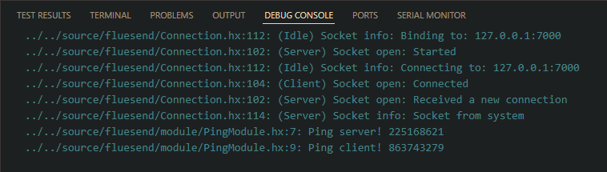

# Fluesend - multiplayer library

Easy-to-use multiplayer library for games and applications, with a unified codebase for both server and client.  
Available for targets with **sys** support as well as **js/html5**.

The library abstracts the low-level `socket` API into `connections` and `callback modules`, enabling the use of `RPC` with `return` statements and transmission of `structures`.

Additionally, the library provides mechanisms for crash protection and security.

## Installation

`haxelib git fluesend https://github.com/Teslotik/Fluesend.git`

## Featrues

- Same codebase for server and client, with the ability to tweak behavior when needed

- `Callback modules` (chain) for data receiving, custom validation, command modification, and encryption (coming soon)

- `RPC` targeting by `scope` and support for `return` values

- Validation of message length, deserialization recursion, unauthorized type deserialization, and custom authentication

- Simple HTTP `requests` and `response` parsing

- Exception handling

- Debugging traces (can be enabled/disabled)

- Connection retry logic for both server and client

- Custom protected binary `serializer` following Haxe `serializer` specification, allowing marking of fields for serialization

- WebSocket frame encoding and decoding

- Message buffering

- Tested on `js/html5` and `hl` targets

- **Examples** available for **cursor synchronization**, **chat**, **P2P chat (in progress)**, and **ping** — see the `example` folder

- **See cookbook below**

## Screenshots




## Show me the code!

A simple chat example.

```haxe
import fluesend.Connection;
import fluesend.Scope;
import fluesend.Module;

// `Module` is a collection of callbacks with some context information
class ChatModule extends Module {
    // Regular variable
    var name:String = "Anon";

    public function new(connection:Connection, name:String) {
        super(connection);  // register module in connection
        this.name = name;
    }

    // Rpc method
    @:rpc(Scope.Others) // <-- message receivers
    function doSendMessage(message:String) {    // you can pass almost all types and multiple values
        trace('${name} received a new message: ${message}');
    }

    // Regular method
    public function sendMessage(message:String) {
        // Add sender info
        doSendMessage('[${name}] ${message}');
    }
}

// Emulates multiple users on one computer
class Chat {
    // `Connection` is a socket abstraction to work seamlessly with servers and clients
    // It also unifies platform-specific API and handles errors and callbacks
    var ivan:Connection = new Connection();
    // Create callbacks for Ivan
    var ivanChat:ChatModule = null;
    
    // In real-world applications, each side has just one connection representing itself
    var boris:Connection = new Connection();
    // Create callbacks for Boris
    var borisChat:ChatModule = null;

    var dimitry:Connection = new Connection();
    var dimitryChat:ChatModule = null;
    
    // Just a random messages
    var messages = [
        "Hello",
        "Ok",
        "Whats up?",
        "What are you doing?",
        "Can you help?",
        "Weather is cold",
        "Do you have a cat?",
        "Did you see a new GUI library called Juil?"
    ];

    public function new() {
        // Pass the connection to register a module on that connection
        ivanChat = new ChatModule(ivan, "Ivan");
        borisChat = new ChatModule(boris, "Boris");
        dimitryChat = new ChatModule(dimitry, "Dimitry");

        // Create a server
        ivan.bind("127.0.0.1", 7000, 10);
        // Create clients
        boris.connect("127.0.0.1", 7000);
        dimitry.connect("127.0.0.1", 7000);

        for (_ in 0...30) {
            // Accept connections and read data
            ivan.poll();
            boris.poll();
            dimitry.poll();

            // Take a random message
            var message = messages[Math.floor(Math.random() * messages.length)];
            // Choose a sender
            if (Math.random() < 0.5) {
                // Add message to the output queue
                // Ivan will send the message to others (because of the `sendMessage` scope)
                ivanChat.sendMessage(message);
            } else {
                // Boris will send the message to others
                borisChat.sendMessage(message);
            }

            // Send data from the queue to the clients and the server
            // They will receive it in the `poll()` method
            ivan.flush();
            boris.flush();
            dimitry.flush();

            Sys.sleep(0.5);
        }
    }

    static function main() {
        new Chat();
    }
}
```


## Cookbook

### Serialization

Notice that recursive references don't work - the library exception will rise

```haxe
var l = new List<{x:Float, y:Float}>();
l.add({
    x: 1,
    y: 2
});

var binary = serializer.serialize({
    a: 5,
    greetings: "Hello world",
    c: [1, 2, 3],
    d: {
        pp: 6.9,
        sen: "hi",
        l: l
    },
    e: true,
    f: false,
    g: [
        "a" => 1,
        "b" => 2
    ],
    h: [
        1 => 1,
        2 => 2
    ],
    i: [
        l => 1
    ]
    // etc
});

var obj = serializer.deserialize(binary);
```

### Custom types

Register types and enums so serializer could serialize and deserialize them

```haxe
connection.serializer.registerType(Player);
connection.serializer.registerEnum(AttackEnum);
```

### Specific fields serialization

```haxe
// true to include just `@s` fields
serializer.useMarkedFields = true;  // true by default

class Enemy {
    // Serializable
    @s var id:Int = 5;
    // Non-serializable
    var color:Int = 0xFF;
}
```

### Validation

```haxe
class AuthModule extends Module {
    // The socket argument is always the socket to which data is sent (can be a client or a server socket!)
    override function onValidate(socket:Socket, command:Command):Bool {
        if (connection.isServer) {
            if (command is RpcCommand) {
                var command:RpcCommand = cast command;
                
                // Only Sasha could login. You can use your DB or something
                if (command.method == "login") {
                    /// @note this custom method has the following signature: login(name:String)
                    return command.args[0] == "Sasha";
                }
            }
        }
        return true;
    }
}
```

### Return values

```haxe
class BookServer extends Module {
    @:rpc(Scope.Server)
    public function getBook(id:Int) {
        // ...

        return {
            text: "Dear diary, I’m at a loss for words...",
            tags: ["sadness"]
        }
    }
}

// ...

// Each sender in the scope will return the value
bookServer.getBook(123).callback = book -> {
    trace(book.text);

    // false to destroy/free the promise
    return false;
}

```

### RPC Scope

```haxe
All;        // to server and clients (default)
Self;       // to self connection (also goes through the server for validation purposes)
Others;     // to other connections

Server;     // to server
Clients;    // to server's clients

// @note `netid` is local for each client for each connection
// so you need to request netid from the server before
Target(netid:Int);  // to custom user
```

### Update loop

For HaxeFlixel

```haxe
// Update loop is the same for server and client
override public function update(elapsed:Float) {
    super.update(elapsed);

    // Retry connection if it is disconnected
    connection.retry();

    // Accept and receive data
    connection.poll();

    // Update position on server and client
    if (FlxG.mouse.deltaX != 0 || FlxG.mouse.deltaY != 0) {
        cursorModule.setPosition(FlxG.mouse.x, FlxG.mouse.y);
    }

    // Send data (position)
    connection.flush();
}
```

### Requests

@tbd

```haxe
var request:Request = Utils.parseHttpRequest(bytesRequest);

var response:Response = // ...
connection.sendRaw(Utils.composeHttpResponse(response));
```
